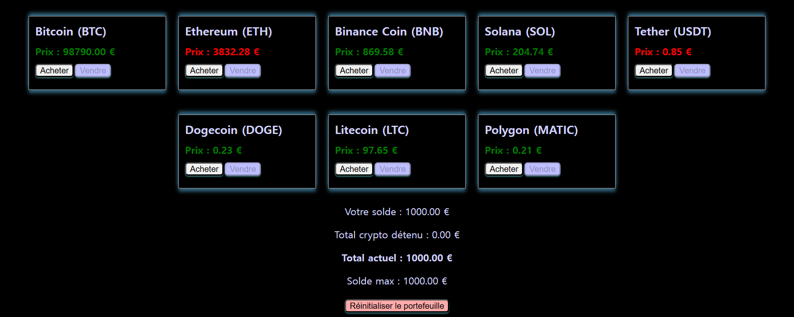

# Simulateur d'achat et de vente de crypto-monnaies
Ce projet est une application web de simulation de portefeuille de cryptomonnaies.
Vous pouvez suivre votre solde, acheter et vendre plusieurs cryptos avec des prix en temps réel grâce à l’API [CoinGecko](https://www.coingecko.com).

## Fonctionnalités principales

 * Affichage de votre solde actuel et du total crypto détenu.
* Acheter et vendre des cryptomonnaies en euros ou en quantité de crypto.
* Mise à jour automatique des prix toutes les 20 secondes.
* Historique de votre solde maximum atteint.
* Couleur dynamique pour visualiser l’évolution des prix :
   * Vert si le prix a augmenté
   * Rouge si le prix a baissé
 * Couleur précédente conservée si le prix est en attente
* Possibilité de réinitialiser votre portefeuille.
* Vos données sont sauvegardées localement grâce à `localStorage`, pour que vous retrouviez votre portefeuille entre vos sessions.
* Vous pouvez modifier le montant initial en euro en remplaçant `this.balance = 1000;` ( ligne 2 de`script.js` )  par la valeur souhaitée.
## Cryptomonnaies disponibles

* Bitcoin (BTC)
* Ethereum (ETH)
* Binance Coin (BNB)
* Solana (SOL)
* Tether (USDT)
* Dogecoin (DOGE)
* Litecoin (LTC)
* Polygon (MATIC)

## Technologies utilisées

* HTML5
* CSS3
* JavaScript ES6+
* API CoinGecko pour les prix des cryptomonnaies

## Fonctionnement

L’application charge les prix depuis l’API CoinGecko.
Vos transactions sont simulées : le solde et vos holdings sont calculés localement.
Votre portefeuille est sauvegardé dans le navigateur grâce à `localStorage`.

## Captures d'écran
Vue de l'application sous Chrome

## Avertissements

L'API coingecko limite l'utilisation de la version gratuite de son API. Elle est limitée à 10 000 appels par mois.
Vous pouvez consulter la [documentation officielle](https://www.coingecko.com/fr/api/pricing).
